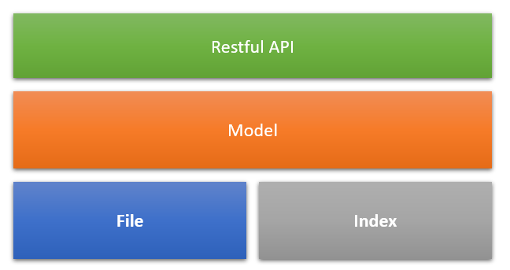

# X/4 Design Time Service

## How to use?

### Start design time service from source code:

```sh
npm run start -- -r C:\Telford\platform\x4 -p 8888
```

### Install design time service from internal npm registry:

Create file .npmrc in your project repository and add below content:

```sh
@sap:registry="https://nexus.wdf.sap.corp:8443/nexus/content/groups/build.snapshots.npm/"
strict-ssl=false
```

Run `npm install --save @sap/x4-dts` to add design time service module as a dependency.

You can use command `x4-dts` to start design time service.

## Overall Design

### In order to achieve loose coupling and reusable design, design time service module is divided into several sub-modules.



1. **_File._** File module encapsulates technical details of file repository and provide an set of abstract APIs to other modules. After starting, it will also watch corresponding file repository and update index proactively.
2. **_Index._** Index modules utilize sqlite to save structured model information to accelerate query. The model will be parsed and loaded into index storage during bootstrap process of design time service. After starting, adhoc model index update will be notified by File module.
3. **_Model._** Model module sits above File and Index modules to provide unified service to consumer and hide the technical details of underlying storage mechanisum.
4. **_Restful API._** Restful API module is a thin layer that calls model service and provide restful API to outside via HTTP.
  [API Details](https://app.swaggerhub.com/apis/THOMAS.HU/dts-models/1.0.0)
